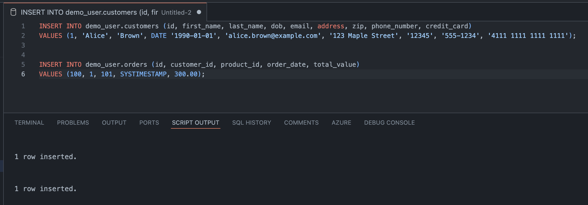
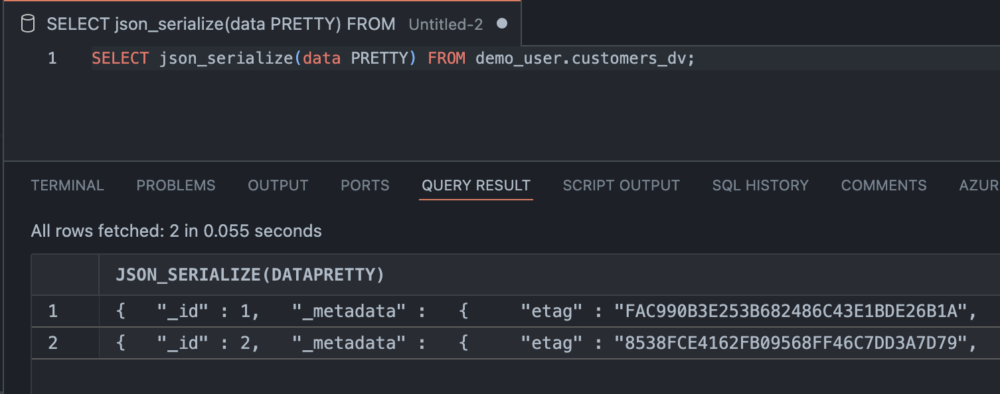

+++
title = 'Exploring JSON Relational Duality with SQL'
date = 2024-09-23T10:41:24Z
description = 'Exploring JSON Relational Duality with SQL'
keywords = 'oracle database 23ai JSON Relational Duality'
draft = false
geekdocBreadcrumb = false
+++

<!--
Copyright (c) 2023, 2024, Oracle and/or its affiliates.
Licensed under the Universal Permissive License v1.0 as shown at http://oss.oracle.com/licenses/upl.
-->

## Introduction

Welcome to the "Exploring JSON Relational Duality with SQL" lab. In this lab, you will learn about the JSON Relational Duality feature, which allows for the seamless integration between the relational and JSON data models. This feature provides the strengths of both approaches, allowing you to easily manipulate data in either model.

## About JSON Relational Duality

JSON Relational Duality is a landmark capability in Oracle Database 23ai providing game-changing flexibility and simplicity for Oracle Database developers. This breakthrough innovation overcomes the historical challenges developers have faced when building applications, using relational or document models.

“JSON Relational Duality in Oracle Database 23ai brings substantial simplicity and flexibility to modern app dev,” said Carl Olofson, research Vice President, Data Management Software, IDC. “It addresses the age-old object - relational mismatch problem, offering an option for developers to pick the best storage and access formats needed for each use case without having to worry about data structure, data mapping, data consistency, or performance tuning. No other specialized document databases offer such a revolutionary solution.”

JSON Relational Duality helps to converge the benefits of both document and relational worlds. Developers now get the flexibility and data access benefits of the JSON document model, plus the storage efficiency and power of the relational model. The new feature enabling this convergence is JSON Relational Duality View (Will be referred below as Duality View).

Key benefits of JSON Relational Duality:

- Experience extreme flexibility in building apps using Duality View. Developers can access the same data relationally or as hierarchical documents based on their use case and are not forced into making compromises because of the limitations of the underlying database. Build document-centric apps on relational data or create SQL apps on documents.
- Experience simplicity by retrieving and storing all the data needed for an app in a single database operation. Duality Views provide fully updateable JSON views over data. Apps can read a document, make necessary changes, and write the document back without worrying about underlying data structure, mapping, consistency, or performance tuning.
- Enable flexibility and simplicity in building multiple apps on same data. Developers can use the power of Duality View to define multiple JSON Views across overlapping groups of tables. This flexible data modeling makes building multiple apps against the same data easy and efficient.
- Duality Views eliminate the inherent problem of data duplication and data inconsistency in document databases. Duality Views are fully ACID (atomicity, consistency, isolation, durability) transactions across multiple documents and tables. It eliminates data duplication across documents data, whereas consistency is maintained automatically.
- Build apps that support high concurrency access and updates. Traditional locks don’t work well for modern apps. A new lock-free concurrency control provided with Duality View supports high concurrency updates. The new-lock free concurrency control also works efficiently for interactive applications since the data is not locked during human thinking time.

## Objectives

This lab aims to provide hands-on experience with JSON-relational Duality Views, demonstrating how to get the strengths of both JSON and relational data models. You will learn how to create, query, and update JSON-relational Duality Views using SQL.


15 minutes


## Task 1: Create Relational Tables

1. Create the 'customers' and 'orders' relational tables. The following code block creates two tables for customer and order data. Copy and run the following SQL script:

    ```sql
    DROP TABLE if exists demo_user.orders CASCADE CONSTRAINTS;

    DROP TABLE if exists demo_user.customers CASCADE CONSTRAINTS;

    -- Create a table to store order data
    CREATE TABLE if not exists demo_user.orders (
        id NUMBER,
        product_id NUMBER,
        order_date TIMESTAMP,
        customer_id NUMBER,
        total_value NUMBER(6,2),
        order_shipped BOOLEAN,
        warranty INTERVAL YEAR TO MONTH
    );

    -- Create a table to store customer data
    CREATE TABLE if not exists demo_user.customers (
        id NUMBER,
        first_name VARCHAR2(100),
        last_name VARCHAR2(100),
        dob DATE,
        email VARCHAR2(100),
        address VARCHAR2(200),
        zip VARCHAR2(10),
        phone_number VARCHAR2(20),
        credit_card VARCHAR2(20),
        joined_date TIMESTAMP DEFAULT SYSTIMESTAMP,
        gold_customer BOOLEAN DEFAULT FALSE,
        CONSTRAINT new_customers_pk PRIMARY KEY (id)
    );

    -- Add foreign key constraint to new_orders table
    ALTER TABLE demo_user.orders ADD (CONSTRAINT orders_pk PRIMARY KEY (id));
    ALTER TABLE demo_user.orders ADD (CONSTRAINT orders_fk FOREIGN KEY (customer_id) REFERENCES demo_user.customers (id));
    ```

## Task 2: Create JSON Relational Duality Views

1. Create a duality view of the customers table. We'll use this one to manage our customer information.
    Using Duality Views, you can define how the data is accessed and used. Duality Views allow you to specify @insert, @update, and @delete privileges, meaning you define exactly how the applications and/or the developers work with data.

    ```sql
    CREATE OR REPLACE JSON RELATIONAL DUALITY VIEW demo_user.customers_dv AS
    demo_user.customers @insert @update @delete
    {
        _id             : id,
        FirstName       : first_name,
        LastName        : last_name,
        DateOfBirth     : dob,
        Email           : email,
        Address         : address,
        Zip             : zip
        phoneNumber     : phone_number
        creditCard      : credit_card
        joinedDate      : joined_date
        goldStatus      : gold_customer
    };
    ```

2. Say we want to exclude sensitive personally identifiable information like customers credit card or phone numbers. Let's create another view withoutthose identifiers.

    ```sql
    CREATE OR REPLACE JSON RELATIONAL DUALITY VIEW demo_user.customer_orders_dv AS
    demo_user.customers
    {
        _id              : id,
        FirstName        : first_name,
        LastName         : last_name,
        Address          : address,
        Zip              : zip,
        orders : demo_user.orders @insert @update @delete
        [
            {
                OrderID       : id,
                ProductID     : product_id,
                OrderDate     : order_date,
                TotalValue    : total_value,
                OrderShipped  : order_shipped
            }
        ]
    };
    ```

    If you notice, this view doesn’t specify @insert, @update, or @delete on our customers table. You created this view so that you can only update orders through the customer_orders_dv Duality View, and no sensitive customer information (such as customers’ credit card numbers or phone numbers) will be shown. The only way to manage that information is through the customers_dv view.

    

    

## Task 3: Add Data

1. Now that the duality view has been created, we can insert data to the relational table or into the duality view. Let's start with adding data directly to the relational tables.

    ```sql
    INSERT INTO demo_user.customers (id, first_name, last_name, dob, email, address, zip, phone_number, credit_card)
    VALUES (1, 'Alice', 'Brown', DATE '1990-01-01', 'alice.brown@example.com', '123 Maple Street', '12345', '555-1234', '4111 1111 1111 1111');


    INSERT INTO demo_user.orders (id, customer_id, product_id, order_date, total_value)
    VALUES (100, 1, 101, SYSTIMESTAMP, 300.00);
    ```

    

2. Let's now insert data into the duality view of our customer data.

    ```sql
    INSERT INTO demo_user.customers_DV values ('{"_id": 2, "FirstName": "Jim", "LastName":"Brown", "Email": "jim.brown@example.com", "Address": "456 Maple Street", "Zip": 12345}');

    commit;
    ```

3. Let's see how the duality views have changed.

    This Duality View will show us two customers.

    ```sql
    SELECT json_serialize(data PRETTY) FROM demo_user.customers_dv;
    ```

    

    This Duality View will show us the same two customers - one with an order and one without.

    ```sql
    SELECT json_serialize(data PRETTY) FROM demo_user.customer_orders_dv;
    ```

    

4. Let's see how the relational tables have changed.

    ```sql
    select * from demo_user.customers;
    ```

    

## Task 4: Update Data

1. Remember, the customer_orders_dv duality view only allows us to modify the order data. Let's update Alice's orders.

    ```sql
    UPDATE demo_user.customer_orders_dv c
    SET c.data = json_transform(
        data,
        APPEND '$.orders' = JSON {'OrderID':123, 'ProductID' : 202, 'OrderDate' : SYSTIMESTAMP, 'TotalValue' : 150.00}
    )
    WHERE c.data."_id" =1;
    commit;

    select json_serialize(data PRETTY) from demo_user.customer_orders_dv o where o.data."_id" = 1;
    ```

    

2. Let's now try and update Alice's last name. You'll see that this is not allowed!

    ```sql
    UPDATE demo_user.customer_orders_dv c
    SET c.data = json_transform(
        data,
        SET '$.LastName' = 'Browne'
    )
    WHERE c.data."_id" =1;
    ```

    

3. Let's insert some orders for our customer Jim Brown using `mergepatch`.

    ```sql
    update demo_user.customer_orders_dv o set data = json_mergepatch(data,'{"orders" :
    [
        {
        "OrderID": 100,
        "ProductID": 10100,
        "OrderDate": "2024-06-27T11:55:20.174683",
        "TotalValue": 300,
        "OrderShipped": null
        },
        {
        "OrderID": 200,
        "ProductID": 20002,
        "OrderDate": "2024-06-27T11:55:50.424141",
        "TotalValue": 150,
        "OrderShipped": null
        }
    ]}')
    where o.data."_id" = 2;

    commit;
    ```

4. Imagine we needed to change one of the Product IDs, for example product_id = 202 shown below.

    ```sql
    SELECT json_serialize(data PRETTY) FROM demo_user.customer_orders_dv;
    ```

5. Using a single update statement, we can easily update product_id 202 to 999 in every JSON duality view.

    ```sql
    UPDATE demo_user.orders
    SET product_id = 999
    WHERE product_id = 202;

    commit;

    SELECT json_serialize(data PRETTY) FROM demo_user.customer_orders_dv;
    ```

    You can now see that the update made to the orders table has propogated to the customer orders duality view, and the same occurs for all other representations of the customers table!

## Wrapping it up

**You've completed the workshop!**

Note that the "etag" value supplied in the content is used for "out-of-the-box" optimistic locking to prevent the well-known "lost update" problem that can occur with concurrent operations. During a replace operation, the database checks that the eTag provided in the replacement document matches the latest eTag of the target Duality View document.

If the eTags do not match, which can occur if another concurrent operation updated the same document, an error is thrown. If you get the error, you can reread the updated value (including the updated eTag), and retry the replace operation again, adjusting it (if desired) based on the updated value.

## Learn More

- [JSON Relational Duality: The Revolutionary Convergence of Document, Object, and Relational Models](https://blogs.oracle.com/database/post/json-relational-duality-app-dev)
- [JSON Duality View documentation](https://docs.oracle.com/en/database/oracle/oracle-database/23/jsnvu/overview-json-relational-duality-views.html#)

## Acknowledgements

- Authors:
  - [Killian Lynch](https://www.linkedin.com/in/killian-lynch/), Senior Product Manager.
- Last Updated By/Date - Paulo Alberto Simoes, September 2024.
