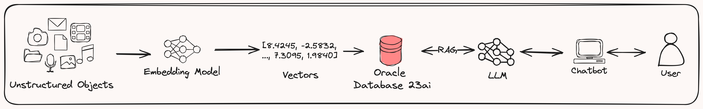
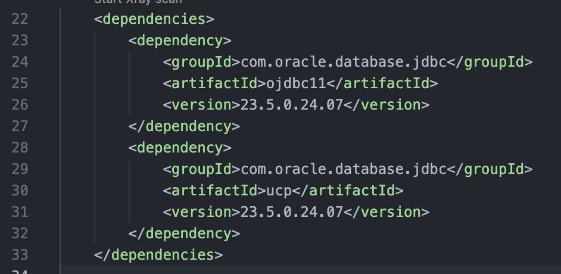

+++
title = 'Retrieval-Augmented Generation (RAG) with LangChain4j and the Oracle Database 23ai'
date = 2024-09-23T10:41:24Z
description = 'Retrieval-Augmented Generation (RAG) with LangChain4j and the Oracle Database 23ai'
keywords = 'oracle database 23ai rag langchain4j java'
draft = false
geekdocBreadcrumb = false
+++

<!--
Copyright (c) 2023, 2024, Oracle and/or its affiliates.
Licensed under the Universal Permissive License v1.0 as shown at http://oss.oracle.com/licenses/upl.
-->

## Introduction

Oracle Database 23ai now includes *semantic search* capabilities supported by [Oracle AI Vector Search](https://www.oracle.com/database/ai-vector-search/). This feature includes a [new vector data type](https://docs.oracle.com/en/database/oracle/oracle-database/23/nfcoa/ai_vector_search.html#GUID-aivecsearch-general1), vector indexes vector indexes, and vector search SQL operators that enable the Oracle Database to store the semantic content of documents, images, and other unstructured data as vectors, and use these to build [Generative AI](https://www.oracle.com/ie/artificial-intelligence/generative-ai/what-is-generative-ai/) applications with fast similarity queries.

These new capabilities also support [Retrieval Augmented Generation (RAG)](https://www.oracle.com/ie/artificial-intelligence/generative-ai/retrieval-augmented-generation-rag/), a breakthrough generative AI technique that combines [Large Language Models (LLMs)](https://www.oracle.com/ie/artificial-intelligence/large-language-model/) and business data to deliver more informed answers to natural language questions.

[LangChain4j](https://docs.langchain4j.dev/) is a library that simplifies integrating LLMs into Java applications. It allows you to create AI Services and implement several GenAI use cases, such as RAG, Tools, Chains, Chat Completion, Multimodal, and others.

## Objectives

This lab aims to provide hands-on experience with AI Vector Search to building an RAG application with LangChain4J and OpenAI, cover the creation of vector tables, perform basic DDL operations, and dive into similarity search using some of the new SQL functions in Oracle Database 23ai. Also, the connection with OpenAI to build a Retrieval Augmented Generation (RAG) application.


20 minutes


## Understanding what are vectors

Before we add data, let's understand what vectors are (mathematically) and how they relate to Generative AI.

A vector is simply an array of numbers. Mathematically, a vector is an object that has both magnitude and direction (think of an arrow plotted on a graph). In generative AI, vectors represent the semantic meaning of objects, such as pictures, documents, audio files, or other large unstructured objects.

How do we get vectors?

Vectors are created by 'processing' your large unstructured objects through an embedding model. The models transform or 'embed' the data into numerical representations (vectors) that represent the semantic meaning of the original object.


Okay, so what?

At a high level, vectors are what these large language models use under the covers. Through storing vectors in the Oracle database, you can create countless applications that utilize generative AI capabilities and build the next generation of AI applications. The following diagram shows a VERY high-level overview of how you would create a chatbot application that can use an LLM in combination with private company data to answer questions specific to YOUR data. This process is called Retrieval Augmented Generation, or RAG.



## Task 2: Connect to your Oracle Database

The first step is to add the required Oracle JDBC and UCP JARs as dependencies. You have to include the JAR dependencies listed below in your Maven [pom.xml](../../../raglangchain4j/pom.xml) file.

- [ojdbc11–23.5.0.24.07.jar](https://central.sonatype.com/artifact/com.oracle.database.jdbc/ojdbc11)
- [ucp-23.5.0.24.07.jar](https://central.sonatype.com/artifact/com.oracle.database.jdbc/ucp)



## Task 3: Make a Clone of the Workshop Source Code

To work with the application code, you need to make a clone from the GitHub repository using the following command.  

```bash
git clone --single-branch https://github.com/pasimoes/db23ai-intro-workshop.git
```

You should now see the directory `rag_langchain4j` in the directory that you created.

## Task 4: App Development

Configure environment variables to store such values and retrieve them from your Java code as shown below.

```java
public class OracleDBUtils {

  // JDBC CONNECTION DETAILS
  private static final String URL = "jdbc:oracle:thin:@127.0.0.1:1521/FREEPDB1";
  private static final String USERNAME = System.getenv("DB_23AI_USERNAME");
  private static final String PASSWORD = System.getenv("DB_23AI_PASSWORD");
```

## The LangChain4J application

It’s beyond the scope of this lab to teach you about all things LangChain4J. Nevertheless, LangChain4j is a library that simplifies integrating LLMs into Java applications. It allows you to create AI Services and implement several GenAI use cases, such as RAG, Tools, Chains, Chat Completion, Multimodal, and others.

Our main goal is to show you how to properly implement a GenAI RAG application with LangChain4J, OpenAI, Oracle AI Vector Search, and the Oracle Database 23ai.

The first scenario is a simple test application, that will allow you to perform a simple chat interaction with OpenAI.

1. Create A New API Key

    Go to the [API Keys](https://platform.openai.com/api-keys) page, select a project and click on the button Create new secret key.

    In the next pop, just add the name of your API key so you can remember it in the future. Every project could use more than one API key for different things.

    Once you create the key, you should save it somewhere *safe* and *accessible*. For security reasons, *you won’t be able to view it again* through your OpenAI account. If you lose this secret key, you’ll need to generate a new one.

    This sounds more scary than it actually is. But it is correct. If you lose your API key, you will have to create a new one. In the same way, you can create as many keys as you need.

    Configure environment variables to store such value

    ```java
    public class LangChain4JOpenAiBasicChat {

    public static void main(String[] args) {

      OpenAiChatModel model = OpenAiChatModel
          .withApiKey(System.getenv("OPENAI_API_KEY"));
    ```

2. Run the sample app.

    Basically, we’ll ask a question about someone, could be you or me and get an imprecise answer as OpenAI does not know about this person.

    ```java
    OpenAiChatModel model = OpenAiChatModel
        .withApiKey(System.getenv("OPENAI_API_KEY"));
    
    String answer = model.generate("Who is Paulo Alberto Simoes?");
    ```

    And the imprecive answer:

    ```cmd
    ANSWER:

    There is not enough information available to determine who < someone > is. It is possible that he is a private individual with no notable public presence.
    ```

3. Move to an augment the context...

    The second scenario covers the main application components are based on LangChain4J, specifically an implementation of a required OracleEmbeddingStore Java interface and the Oracle AI Vector Search features of Oracle Database 23ai.

    OracleDb23aiLangChain4JOpenAiRag class is the implementation at the core of our Retrieval-Augmented Generation (RAG) use case. Note that it is the main entry point (main method) to execute the final application.

    Besides, it uses a PDF file, JuarezBarbosaJunio.pdf, under /src/main/resources to support a comparison between a search about the Juarez without RAG and another one with some information from his online profile.

    It supports the implementation of RAG by performing four basic tasks as below:

    - Gets the PDF file to be ingested and stored as vectors
    - Extracts the content from the PDF file
    - Initializes the OpenAI embedding model to support the embedding step
    - Initializes the Vector embedding store per the requirements

    ```java
    public class OracleDb23aiLangChain4JOpenAiRag {

    ...

    public static void main(String[] args) throws SQLException {

      Path pdfFilePath = Paths.get(
          "< location >/rag_langchain4j/src/main/resource/<my>.pdf");

      // Read and extract text from the PDF
      String pdfContent = extractTextFromPdf(pdfFilePath);

      if (pdfContent != null && !pdfContent.isEmpty()) {

        // Initialize the embedding model
        OpenAiEmbeddingModel embeddingModel = OpenAiEmbeddingModel.builder()
            .apiKey(System.getenv("OPENAI_API_KEY"))
            .modelName("text-embedding-3-large").build();

        // Initialize the Oracle embedding store
        OracleEmbeddingStore embeddingStore = new OracleEmbeddingStore(
            OracleDBUtils.getPooledDataSource(), "ORACLE_VECTOR_STORE",
            Integer.valueOf("3072"), Integer.valueOf("95"), OracleDistanceType.COSINE,
            OracleIndexType.IVF, Boolean.valueOf(true), Boolean.valueOf(true),
            Boolean.valueOf(true), Boolean.valueOf(true));
    ```

    *OracleEmbeddingStoreIngestor* will create an Ingestor component that creates the embedding using an [EmbeddingModel](https://docs.langchain4j.dev/category/embedding-models/) and the related [EmbeddingStore](https://docs.langchain4j.dev/category/embedding-stores/) implementation (Oracle) to create the embeddings.

    **OracleEmbeddingStore**, A class that provides an implementation of *dev.langchain4j.store.embedding*.EmbeddingStore for the Oracle Database 23ai, along with information to support the Oracle AI Vector search mechanisms and the Oracle Database vector store and associated vector embeddings.

    ```java
    public class OracleEmbeddingStore implements EmbeddingStore<TextSegment> {
    private static final Logger log = LoggerFactory
        .getLogger(OracleEmbeddingStore.class);
    // VECTOR SEARCH
    private static final Integer DEFAULT_DIMENSIONS = -1;
    private static final Integer DEFAULT_ACCURACY = -1;
    private static final OracleDistanceType DEFAULT_DISTANCE_TYPE = OracleDistanceType.COSINE;
    private static final OracleIndexType DEFAULT_INDEX_TYPE = OracleIndexType.IVF;
    // EMBEDDING STORE DETAILS / ORACLE DATABASE 23ai
    private final String table;
    private final DataSource dataSource;
    private final Integer accuracy;
    private final OracleDistanceType distanceType;
    private final OracleIndexType indexType;
    private final Boolean normalizeVectors;

   ```

4. Run the LangChain4J application

  Select the main class, and execute it with your preferred IDE. We’ll do it here in debugging mode just for learning purposes.

  ```cmd
  ANSWER: 
  Juarez Barbosa Junior is an accomplished professional with over 20 years of experience in software engineering, developer relations, and technology evangelism. He currently serves as the Sr. Principal Java Developer Evangelist – Director of Developer Evangelism at Oracle. Previously, he has held significant positions such as the Azure Developer Relations Lead at Microsoft and a Thought Leader and Technical Evangelist at IBM.

  His technical expertise spans a wide range of areas including Java, Python, Cloud Computing (Oracle OCI, Azure, GCP, IBM Cloud, and AWS), DevOps, Infrastructure as Code (IaC), Continuous Integration/Delivery (CI/CD), and Cloud Native technologies. Juarez is also a polyglot software engineer, proficient in languages such as Java, Kotlin, Golang, Python, C, C++, Javascript, and is currently learning Rust.

  ....

  ```

  To confirm that, you can run an SQL query below to see the actual vector embeddings as expected.

  ```sql
  SQL> select * from DEMO_USER.ORACLE_VECTOR_STORE;

  ID                                      CONTENT                                                                             METADATA    EMBEDDING                                                                           
  ___________________________________________________________________________________ ___________ 
  5fae6a04-275f-4301-86d2-21508817c599    Juarez Barbosa Junior is a Sr. Principal Java Developer Evangelist – Director of    {}          [-6.9423341192305088E-003,8.4871035069227219E-003,-1.3263838365674019E-002,-1.27  
  ```

## Wrapping it up

**You've completed the workshop!**

You can now create your RAG applications with Java, OpenAI, and the Oracle Database 23ai combined with Oracle AI Vector Search.

## Acknowledgements

- Authors:
  - [Juarez Junior](https://www.linkedin.com/in/jujunior/), Sr. Principal Java Developer Evangelist.
  - [Paulo Alberto Simoes](https://www.linkedin.com/in/pasimoes/), Cloud Architect.
- Last Updated By/Date - Paulo Alberto Simoes, September 2024.
