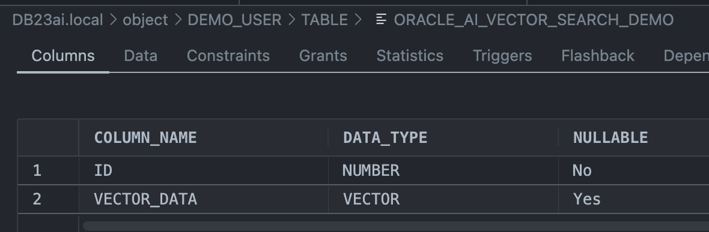
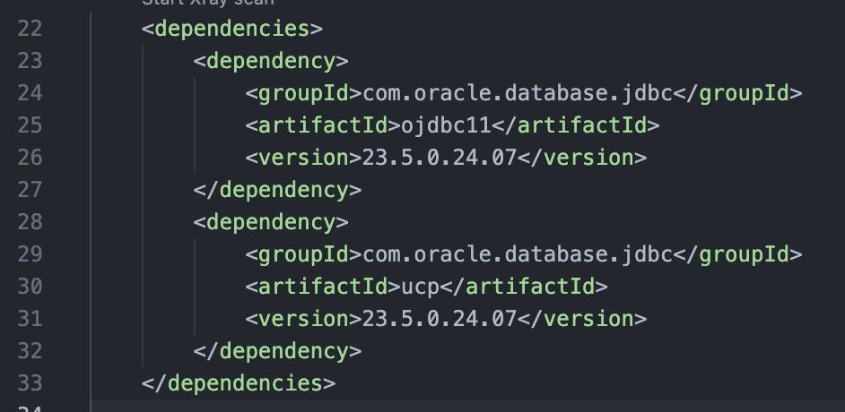
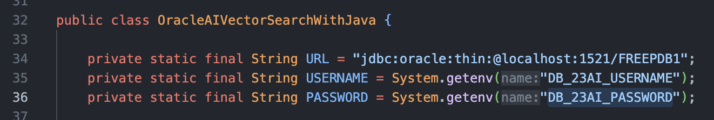

+++
title = 'Oracle AI Vector Search for Java Developers with the Oracle Database 23ai'
date = 2024-09-23T10:41:24Z
description = 'Oracle AI Vector Search for Java Developers with the Oracle Database 23ai'
keywords = 'oracle database 23ai vector search java'
draft = false
geekdocBreadcrumb = false
+++

<!--
Copyright (c) 2023, 2024, Oracle and/or its affiliates.
Licensed under the Universal Permissive License v1.0 as shown at http://oss.oracle.com/licenses/upl.
-->

## Introduction

Oracle Database 23ai now includes *semantic search* capabilities supported by [Oracle AI Vector Search](https://www.oracle.com/database/ai-vector-search/). This feature includes a [new vector data type](https://docs.oracle.com/en/database/oracle/oracle-database/23/nfcoa/ai_vector_search.html#GUID-aivecsearch-general1), vector indexes, a Vector Utility API, Support for ONNX-Format Models as First-Class Database Objects, and new vector search SQL operators and syntax. Such features enable Oracle Database 23ai to store the semantic content of documents, images, and other unstructured data as vectors, and use these to run fast similarity queries.

Speaking of Java, Oracle JDBC has added the necessary components to the JDBC drivers to support the AI Vector Search and the Vector Data Type, including SQLType, DatabaseMetaData, ResultSetMetaData and ParameterMetaData, VectorMetaData, Java to SQL Conversions with PreparedStatement and CallableStatement, SQL to Java Conversions with CallableStatement, SQL to Java Conversions with CallableStatment and ResultSet, and VECTOR Datum class. For all the details please check the [Working with Vectors](https://docs.oracle.com/en/database/oracle/oracle-database/23/jjdbc/working-with-vectors.html) section of the [JDBC Developer’s Guide](https://docs.oracle.com/en/database/oracle/oracle-database/23/jjdbc/preface.html).

## Objectives

This lab aims to provide hands-on experience with AI Vector Search, cover the creation of vector tables, perform basic DDL operations, and dive into similarity search using some of the new SQL functions in Oracle Database 23ai. This lab is meant to be a small introduction to the new AI functionality that Oracle Database 23ai supports.


20 minutes


## Task 1: Create Vector Sample Table

Now, let’s create the required database table with the SQL script; it’s also included below for your convenience. Note the specification of a VECTOR data type column below as VECTOR_DATA VECTOR(3, FLOAT64).

```sql
DROP TABLE if exists demo_user.oracle_ai_vector_search_demo CASCADE CONSTRAINTS;

-- Create a table to store vector data
CREATE TABLE if not exists demo_user.oracle_ai_vector_search_demo (
    id NUMBER PRIMARY KEY,
    vector_data VECTOR(3, FLOAT64)
);

COMMIT;
```



## Task 2: Connect to your Oracle Database

The first step is to add the required Oracle JDBC and UCP JARs as dependencies. You have to include the JAR dependencies listed below in your Maven [pom.xml](../../../ai_vector_search_java/pom.xml) file.

- [ojdbc11–23.5.0.24.07.jar](https://central.sonatype.com/artifact/com.oracle.database.jdbc/ojdbc11)
- [ucp-23.5.0.24.07.jar](https://central.sonatype.com/artifact/com.oracle.database.jdbc/ucp)



## Task 3: Make a Clone of the Workshop Source Code

To work with the application code, you need to make a clone from the GitHub repository using the following command.  

```bash
git clone --single-branch https://github.com/pasimoes/db23ai-intro-workshop.git
```

You should now see the directory `ai_vector_search_java` in the directory that you created.

## Task 4: App Development

1. JDBC connection details

    Configure environment variables to store such values and retrieve them from your Java code as shown below.

    

    **The oracle.jdbc.OracleType Java Enum and the VECTOR constants**

    JDBC drivers represent SQL data types as instances of the [java.sql.SQLType](https://docs.oracle.com/en%2Fjava%2Fjavase%2F22%2Fdocs%2Fapi%2F%2F/java.sql/java/sql/SQLType.html) interface. For each data type of Oracle Database, the Oracle JDBC Driver declares an instance of SQLType as a member of [oracle.jdbc.OracleType](https://docs.oracle.com/en/database/oracle/oracle-database/23/jajdb/oracle/jdbc/OracleType.html).

    New instances of SQLType have been added to the oracle.jdbc.OracleType enum for Vector support. These instances represent the VECTOR data type. In summary:

    - VECTOR — [OracleType.VECTOR](https://docs.oracle.com/en/database/oracle/oracle-database/23/jajdb/oracle/jdbc/OracleType.html#VECTOR) represents a Vector of any type, that is, a type with an asterisk (*) wild card.
    - VECTOR_INT8 — [OracleType.VECTOR_INT8](https://docs.oracle.com/en/database/oracle/oracle-database/23/jajdb/oracle/jdbc/OracleType.html#VECTOR_INT8) represents a Vector of INT8 values.
    - VECTOR_FLOAT32 — [OracleType.VECTOR_FLOAT32](https://docs.oracle.com/en/database/oracle/oracle-database/23/jajdb/oracle/jdbc/OracleType.html#VECTOR_FLOAT32) represents a Vector of FLOAT32 values.
    - VECTOR_FLOAT64 — [OracleType.VECTOR_FLOAT64](https://docs.oracle.com/en/database/oracle/oracle-database/23/jajdb/oracle/jdbc/OracleType.html#VECTOR_FLOAT64) represents a Vector of FLOAT64 values.

    Check the Javadoc documentation (links above) for all the details about each type. Besides, there are new interfaces, such as VectorMetaData, and methods, such as getVectorMetaData, of the OracleResultSetMetaData and OracleParameterMetaData interfaces.

    Once again, for all the details please check the [Working with Vectors](https://docs.oracle.com/en/database/oracle/oracle-database/23/jjdbc/working-with-vectors.html) section of the [JDBC Developer’s Guide](https://docs.oracle.com/en/database/oracle/oracle-database/23/jjdbc/preface.html).

2. Inserting a vector with OracleType.VECTOR

    The method below provides an example of inserting a vector with JDBC. As you can see, from a Java standpoint, it’s quite straightforward. The example uses an array of double values and the **OracleType.VECTOR** type. Besides, the SQL DML query is a simple one as well, with no special syntax for this scenario.

    ```java
        private String insertSql = "INSERT INTO ORACLE_AI_VECTOR_SEARCH_DEMO (ID, VECTOR_DATA) VALUES (?, ?)";
        ...
        private void insertVector(Connection connection) throws SQLException {
            PreparedStatement insertStatement = connection.prepareStatement(insertSql);
            float[] vector = { 1.1f, 2.2f, 3.3f };
            System.out.println("SQL DML: " + insertSql);
            System.out.println("VECTOR to be inserted: " + Arrays.toString(vector));
            insertStatement.setInt(1, randomize());
            insertStatement.setObject(2, vector, OracleType.VECTOR_FLOAT64);
            insertStatement.executeUpdate();
        }
    ```

3. Retrieving a vector as arrays

    The method below provides an example of how to perform SQL selects to retrieve your vectors as arrays.

    ```java
        private String querySql = "SELECT ID, VECTOR_DATA FROM ORACLE_AI_VECTOR_SEARCH_DEMO";
        ...
        private void retrieveVectorAsArray(Connection connection) throws SQLException {
            PreparedStatement queryStatement = connection.prepareStatement(querySql);
            System.out.println("SQL DML: " + querySql);
            ResultSet resultSet = queryStatement.executeQuery();
            float[] vector = null;
            while (resultSet.next()) {
                vector = resultSet.getObject(2, float[].class);
            }
            System.out.println("Retrieved VECTOR: " + Arrays.toString(vector));
        }
    ```

4. Retrieving a vector with a bound vector (input parameter)

    This last example shows how to use a bound array to retrieve your vector based on the [COSINE_DISTANCE](https://docs.oracle.com/en/database/oracle/oracle-database/23/sqlrf/cosine_distance.html#GUID-2128DC1D-612A-444F-87D8-3D249CD8F12D) and the [VECTOR_DISTANCE](https://docs.oracle.com/en/database/oracle/oracle-database/23/sqlrf/vector_distance.html) function.

    *VECTOR_DISTANCE* is the main function that you can use to calculate the distance between two vectors.

    *VECTOR_DISTANCE* takes two vectors as parameters. You can optionally specify a distance metric to calculate the distance. If you do not specify a distance metric, then the default distance metric is Cosine distance.

    ```java
        private String querySqlWithBind = "SELECT ID, VECTOR_DATA FROM ORACLE_AI_VECTOR_SEARCH_DEMO ORDER BY VECTOR_DISTANCE(VECTOR_DATA, ?, COSINE)";

        private void retrieveVectorWithBoundVector(Connection connection) throws SQLException {
            PreparedStatement queryStatement = connection.prepareStatement(querySqlWithBind);
            float[] inputVector = { 1.0f, 2.2f, 3.3f };
            System.out.println("SQL DML: " + querySqlWithBind);
            System.out.println("Bound VECTOR: " + Arrays.toString(inputVector));
            queryStatement.setObject(1, inputVector, OracleType.VECTOR_FLOAT64);
            ResultSet resultSet = queryStatement.executeQuery();
            resultSet.next();
            float[] outputVector = resultSet.getObject(2, float[].class);
            System.out.println("Retrieved VECTOR: " + Arrays.toString(outputVector));
        }
    ```

## Task 5: Run the app — Oracle AI Vector Search with the Oracle JDBC driver

Provided that you followed all the steps above, you can now run the code sample above with your preferred Java IDE. As expected, the messages below will be logged to your console output.

```cmd
Starting JDBC connection with PooledDataSource...
Connected to Oracle Database 23ai! 

Inserting VECTOR with oracle.jdbc.OracleType.VECTOR...
SQL DML: INSERT INTO ORACLE_AI_VECTOR_SEARCH_DEMO (ID, VECTOR_DATA) VALUES (?, ?)
VECTOR to be inserted: [1.1, 2.2, 3.3]
VECTOR with oracle.jdbc.OracleType.VECTOR inserted!

Inserting VECTOR with oracle.jdbc.OracleType.VARCHAR2...
SQL DML: INSERT INTO ORACLE_AI_VECTOR_SEARCH_DEMO (ID, VECTOR_DATA) VALUES (?, ?)
VECTOR to be inserted: [1.1, 2.2, 3.3]
VECTOR with oracle.jdbc.OracleType.VARCHAR2 inserted!

Inserting VECTOR with Batch API...
SQL DML: INSERT INTO ORACLE_AI_VECTOR_SEARCH_DEMO (ID, VECTOR_DATA) VALUES (?, ?)
VECTORs to be inserted as a batch: [1.1, 2.2, 3.3], [1.3, 7.2, 4.3], [5.9, 5.2, 7.3]
VECTOR with Batch API inserted!

Retrieving VECTOR as double array...
SQL DML: SELECT ID, VECTOR_DATA FROM ORACLE_AI_VECTOR_SEARCH_DEMO
Retrieved VECTOR: [5.9, 5.2, 7.3]
VECTOR retrieved!

Retrieving VECTOR as String...
SQL DML: SELECT ID, VECTOR_DATA FROM ORACLE_AI_VECTOR_SEARCH_DEMO
Retrieved VECTOR: [5.900000095367432E+000,5.199999809265137E+000,7.300000190734863E+000]
VECTOR retrieved!

Retrieving VECTOR with bound VECTOR (L2 - Euclidean distance)...
SQL DML: SELECT ID, VECTOR_DATA FROM ORACLE_AI_VECTOR_SEARCH_DEMO ORDER BY VECTOR_DISTANCE(VECTOR_DATA, ?, COSINE)
Bound VECTOR: [1.0, 2.2, 3.3]
Retrieved VECTOR: [1.1, 2.2, 3.3]
VECTOR retrieved!
```

## Wrapping it up

**You've completed the workshop!**

You can now create AI-related applications with Java, JDBC, and the Oracle Database 23ai combined with Oracle AI Vector Search.

Once again, the [Oracle Database 23ai — New Features Guide](https://docs.oracle.com/en/database/oracle/oracle-database/23/nfcoa/introduction.html) provides a comprehensive explanation of this release's features.

## Learn More

- [Oracle Announces General Availability of AI Vector Search in Oracle Database 23ai](https://blogs.oracle.com/database/post/oracle-announces-general-availability-of-ai-vector-search-in-oracle-database-23ai)
- [Oracle AI Vector Search Users Guide](https://docs.oracle.com/en/database/oracle/oracle-database/23/vecse/)
- [OpenAI embedding models](https://openai.com/blog/new-embedding-models-and-api-updates)

## Acknowledgements

- Authors:
  - [Juarez Junior](https://www.linkedin.com/in/jujunior/), Sr. Principal Java Developer Evangelist.
  - [Paulo Alberto Simoes](https://www.linkedin.com/in/pasimoes/), Cloud Architect.
- Last Updated By/Date - Paulo Alberto Simoes, September 2024.
